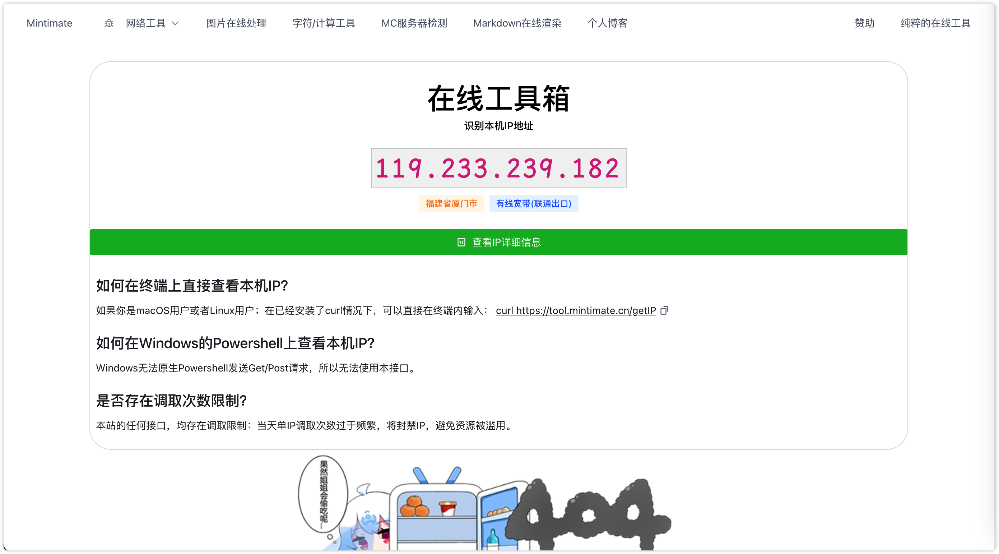

# 项目说明
本项目为[Mintimate's OnlineTool](https://tool.mintimate.cn)的开源仓库。




部分内容，如：腾讯云人工智能识别API；需要自己购买腾讯云接口调用次数并填写自己的请求Token，开源代码已经脱敏。


## 项目结构
项目分为前后端：
```bash
.
├── LICENSE # 开源证书
├── OnlineToolFrontEnd # 页面前端（Vue）
├── OnlineToolFrontEndVite # 页面前端（Vue）(Dev,基于Vite和[Arco](https://arco.design/)全新构建)
└── OnlineToolRearEnd  # 页面后端（Springboot & Python）
```

网站上搭建的版本，为`OnlineToolFrontEnd`前端，基于Element UI + Bootstrap5，Vue2和Vue3的特性混合使用。

`OnlineToolFrontEndVite`版本还在构建，将会基于Arco进行构建。

# 感谢
- IP归属地查询开源代码：[https://github.com/animalize/qqwry-python3](https://github.com/animalize/qqwry-python3)
- Minecraft服务器状态检测: [https://github.com/Dinnerbone/mcstatus](https://github.com/Dinnerbone/mcstatus)
